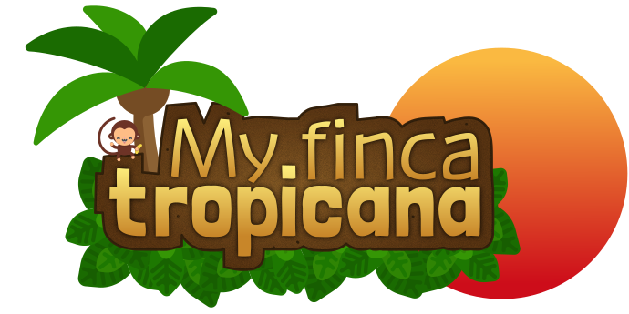

# Accueil

## Présentation
My Finca Tropicana est un jeu vidéo de simulation dans lequel le joueur 
doit gérer sa ferme, capturer et élever des animaux, améliorer son village, 
partir à l'aventure. Dans l'ambiance pittoresque des campagnes tropicales. 
Son gameplay s'inspire directement du célèbre 
[Stardew Valley](https://store.steampowered.com/app/413150/Stardew_Valley/). 
Mais il est hautement orienté multijoueur, avec la possibilité d'héberger 
son propre serveur pour gérer une ou plusieurs ferme avec ses amis. Mais 
aussi de commercer avec tous les autres joueurs solo ou sur serveurs multi.

## Points forts
Contrairement aux jeux de gestion de ferme actuels, toutes les 
[fonctionnalités](./features) de My Finca Tropicana sont pensées pour le
multijoueur.

## Soutenir le développement
My Finca Tropicana est actuellement en **cours de développement**.